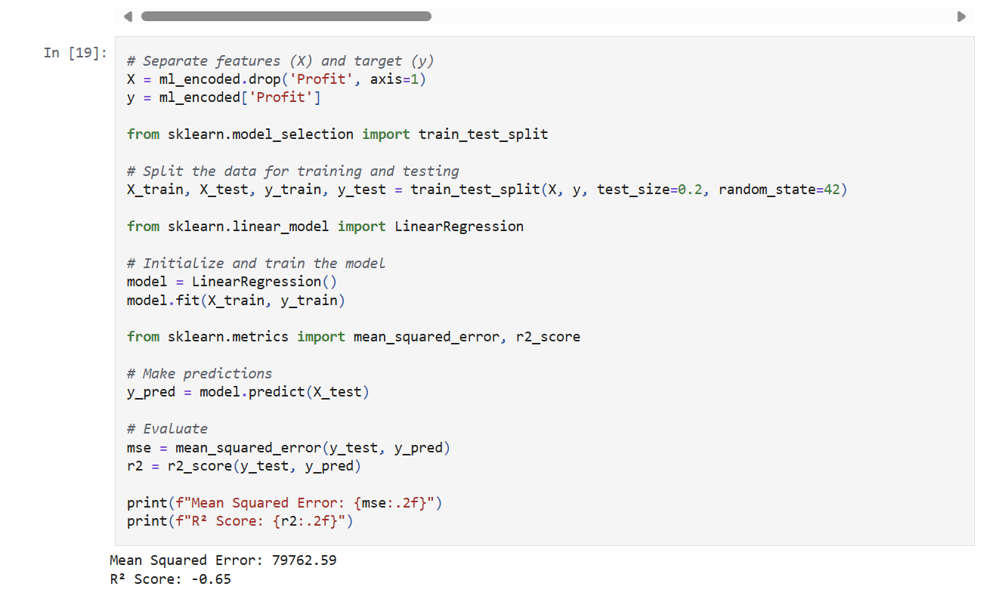
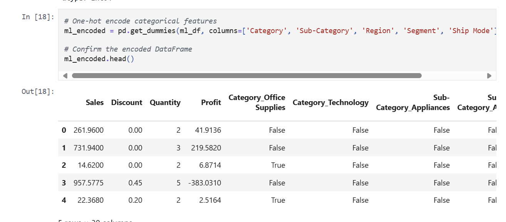
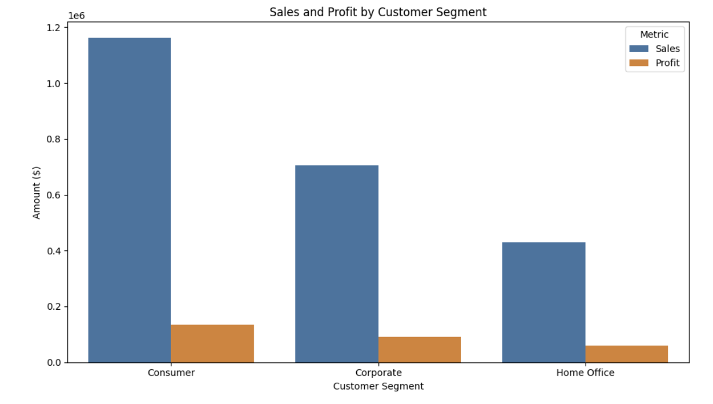
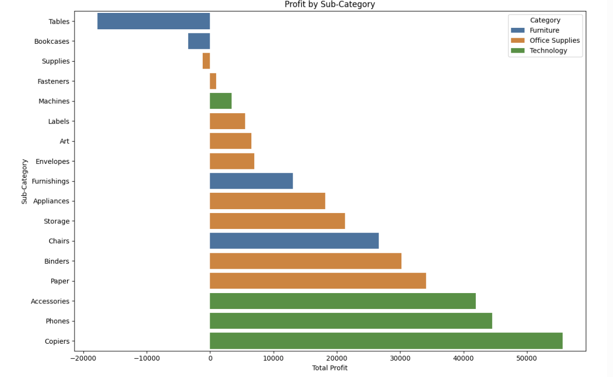
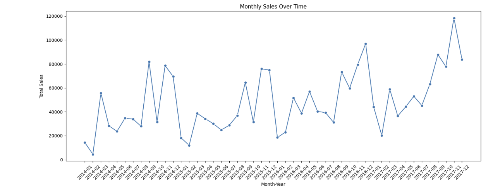

# 🛒 Superstore Sales Analysis

Beginner-friendly sales analysis project using Python, pandas, and matplotlib. The goal is to gain insights from historical sales data and practice key data analysis skills.

## 📁 Project Structure

```bash
superstore-sales-analysis/
├── Data/ # Raw dataset (CSV file)
│ └── Sample - Superstore.csv
├── NoteBooks/ # Jupyter notebook for analysis
│ └── analysis.ipynb
├── README.md # Project overview and instructions
└── .gitignore # Git rules for ignoring unnecessary files
```

## 🧰 Tools Used

- Python 🐍 (v3.13)
- pandas
- matplotlib
- Jupyter Notebooks
- Visual Studio Code
- Git & GitHub

## 🔍 What I Did

- Loaded and explored a real-world sales dataset
- Cleaned and prepped the data
- Converted date columns to datetime format
- Checked for missing values
- Summarized key numeric statistics
- Visualizations & insights coming next! 📊

## 📌 What's Next

- Identify top-performing product categories
- Analyze sales trends by region and time
- Create visualizations with matplotlib
- Share final insights with graphs

## 🚀 Follow My Journey

I’m documenting my data analyst journey step-by-step — each project adds to my skills and portfolio. Connect with me on LinkedIn!

---

🧠 *Practice makes progress.* Stay tuned for more data projects!

📊 Superstore Sales Analysis — Visual Insights Added!
This project explores a real-world sales dataset from a fictional superstore, using Python and pandas for data cleaning and exploration.

✅ Newly added:
Sales Trends Over Time: Monthly patterns and seasonality

Profit by Category/Sub-Category: Uncovered top and bottom performers

Customer Segment Analysis: Compared sales vs. profit across segments

---

## 🔍 GCF Recursive Breakdown – Visualized

These visuals demonstrate how the Greatest Common Factor (GCF) function works step-by-step through recursion:

<table>
<tr>
  <td></td>
  <td></td>
</tr>
<tr>
  <td></td>
  <td></td>
</tr>
<tr>
  <td colspan="2" align="center"></td>
</tr>
</table>

💻 Tools used:
Python • pandas • Matplotlib • Seaborn • Jupyter Notebook • Git

🧠 Machine Learning: Predicting Profit
We introduced a machine learning workflow to predict profit based on historical sales data. Using scikit-learn and linear regression, we explored how key features like discount, quantity, category, and region influence profit.

Highlights:

Selected relevant features for training

One-hot encoded categorical variables

Trained a linear regression model using train_test_split

Evaluated performance with Mean Squared Error (MSE) and R² Score

Outcome:
This initial model acts as a baseline for future ML experiments and optimization.

